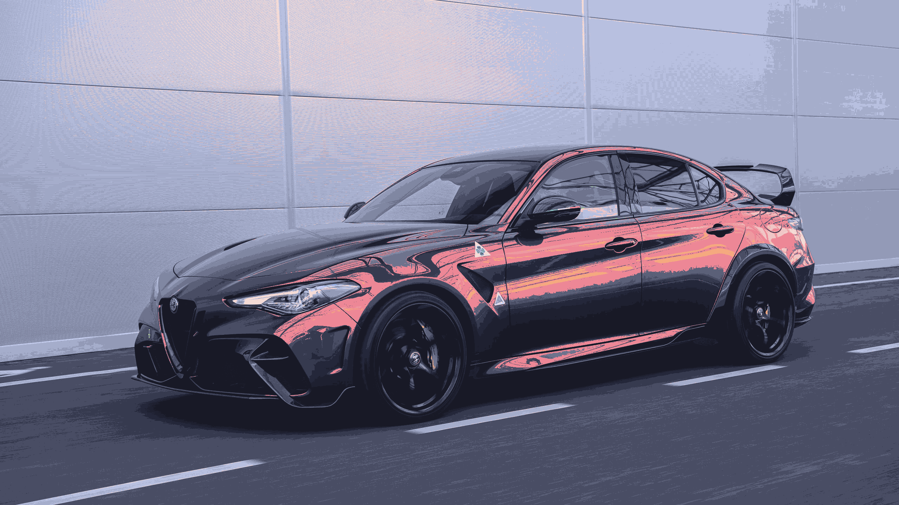
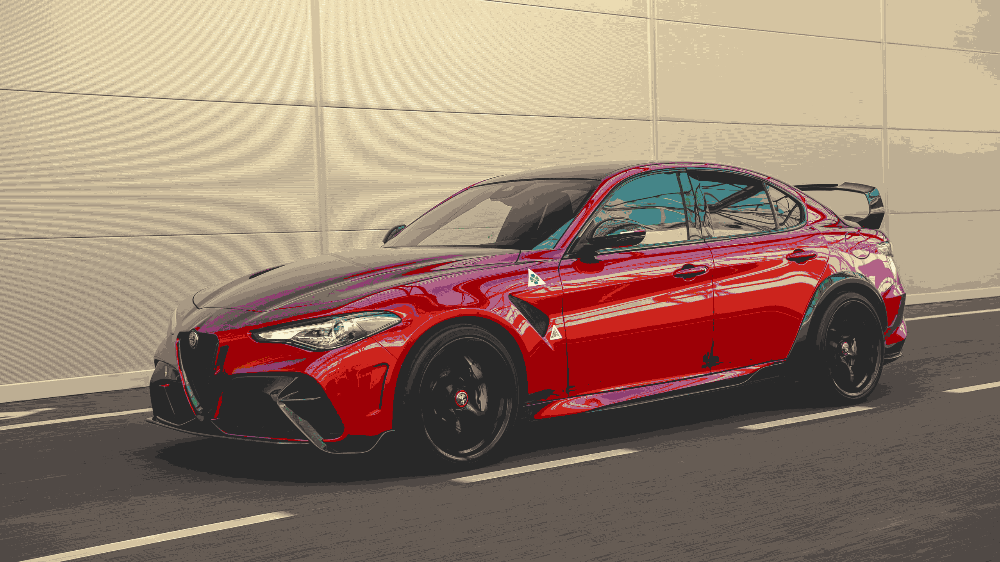
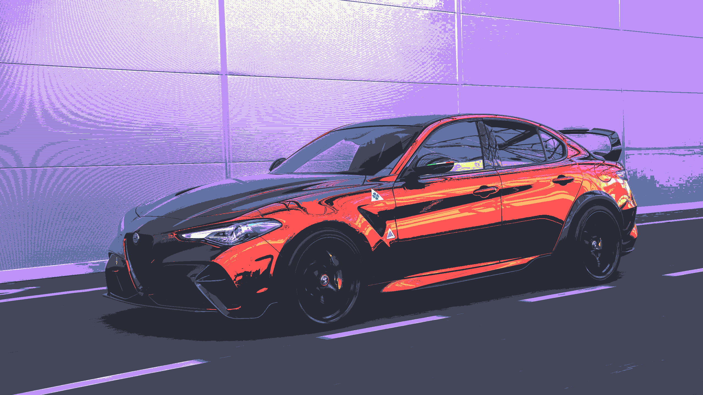

# palettify

<p align="center">


</p>

|                           |                                        |
| :-----------------------: | :------------------------------------: |
|          Normal           |          Catppuccin Macchiato          |
|   |  |
|          Gruvbox          |                Dracula                 |
|  |               |

A tool to match the colors of an image to a palette

## Installation

```
git clone https://github.com/Korazza/palettify.git
```

### pip

```
pip install -r requirements.txt
```

### pipenv

```
pipenv install
```

## Usage

```
python palettify <image path>
```
