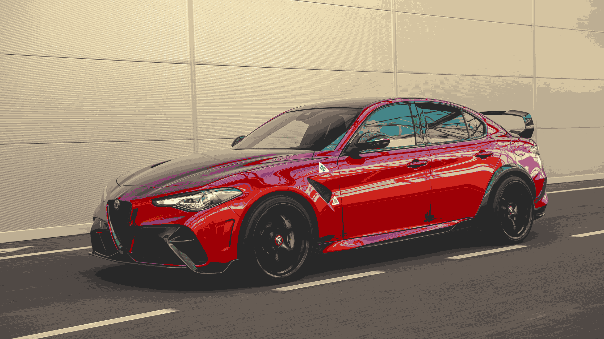

<p align="center">
  
  
  
  
</p>

- [Installation](#installation)
  - [pip](#pip)
  - [pipenv](#pipenv)
- [Usage](#usage)
- [Adding a palette](#adding-a-palette)
  - [Single](#single)
  - [Variants](#variants)

|                                |                                                          |
| :----------------------------: | :------------------------------------------------------: |
|             Normal             |                   Catppuccin Macchiato                   |
|    |  |
|            Gruvbox             |                         Dracula                          |
|  |                            |

A tool to match the colors of an image to a palette

## Installation

```sh
git clone https://github.com/Korazza/palettify.git
```

### pip

```sh
pip install -r requirements.txt
```

### pipenv

```sh
pipenv sync
```

## Usage

```python
import os
import sys
import time

from PIL import Image

from palettify import palettes_loader, palettify_image
from palettify.palette import Palette


def main(args: list[str], palettes_path: str = "palettes"):
    if len(args) <= 0 or len(args) >= 3:
        print("Usage: example.py path/to/image [palette name]")
        sys.exit(1)

    print(args)

    image_path = args[0]
    if not os.path.exists(image_path):
        print(f'Image "{image_path}" does not exist')
        sys.exit(1)

    palettes = palettes_loader.load_palettes(palettes_path)

    palette_name = palettes[0].name
    if len(args) > 1:
        palette_name = args[1]
        if palette_name not in [_p.name for _p in palettes]:
            print(f'Palette "{palette_name}" does not exist')
            sys.exit(1)

    start = time.time()

    palette: Palette = list(filter(lambda p: (p.name == palette_name), palettes))[0]
    image = Image.open(image_path)

    image_result = Image.fromarray(palettify_image(palette, image))
    image_result.save("output.png")

    palette.log(f"Done in {(time.time() - start):.3f}s")
    sys.exit(0)


if __name__ == "__main__":
    main(sys.argv[1:])
```

## Adding a palette

### Single

To add a new palette, simply create a file in `palettes` directory like below

`Rainbow.txt`

```md
#ff6b6b
#ffd93d
#6bcb77
#4d96ff
```

### Variants

If you have multiple variants of a palette, just create a subfolder under `palettes` with all its variants in it

`Rainbow/Pastel.txt`

```md
#ff6b6b
#ffd93d
#6bcb77
#4d96ff
```
