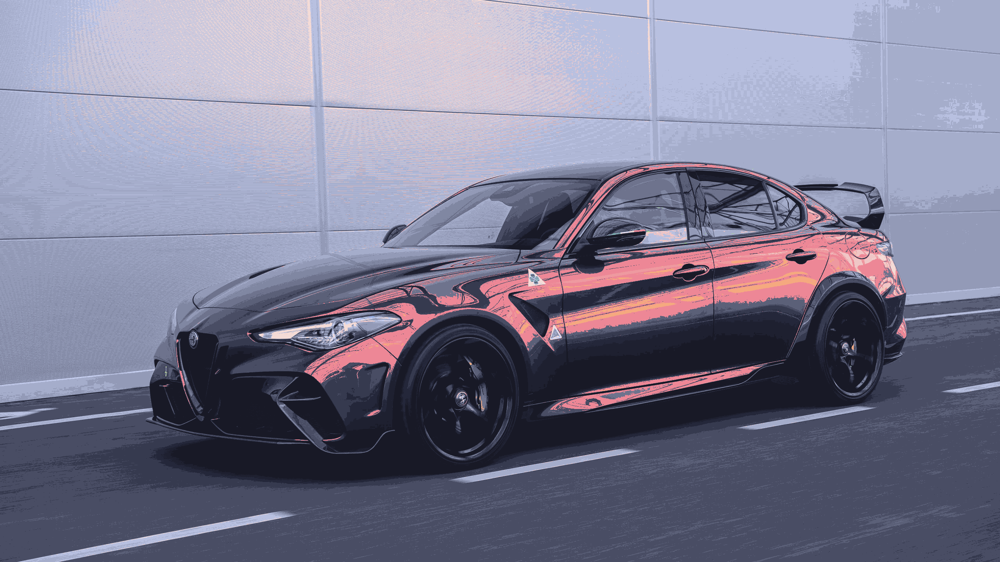
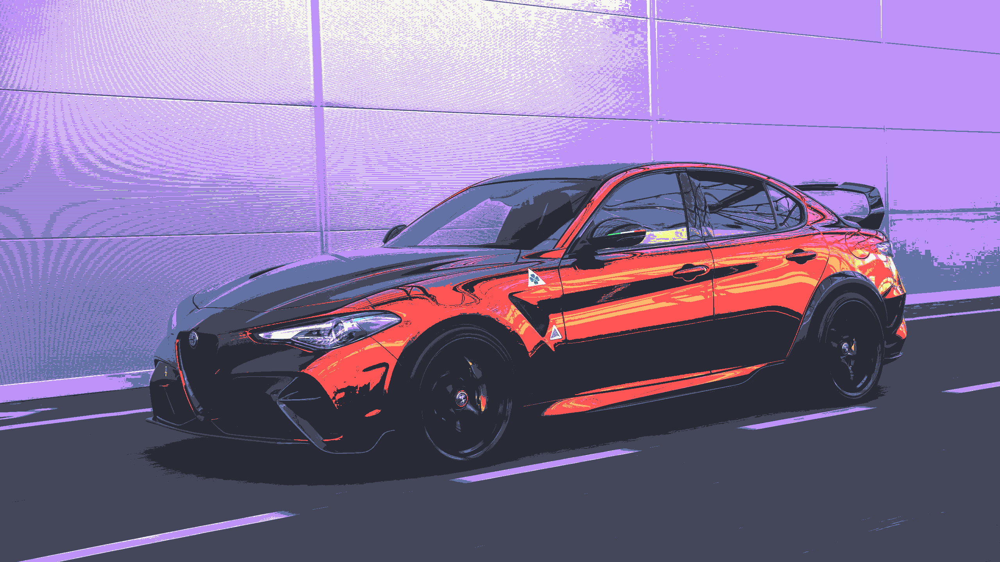

# palettify

A tool to match the colors of an image to a palette

## Usage

`python palettify <image path>`

## Example

|                          |                                       |
| :----------------------: | :-----------------------------------: |
|          Image           |         Catppuccin Macchiato          |
|    |  |
|         Gruvbox          |                Dracula                |
|  |               |
